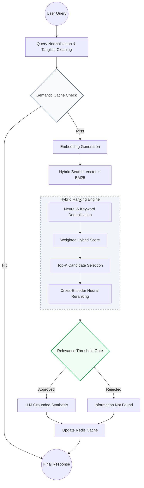
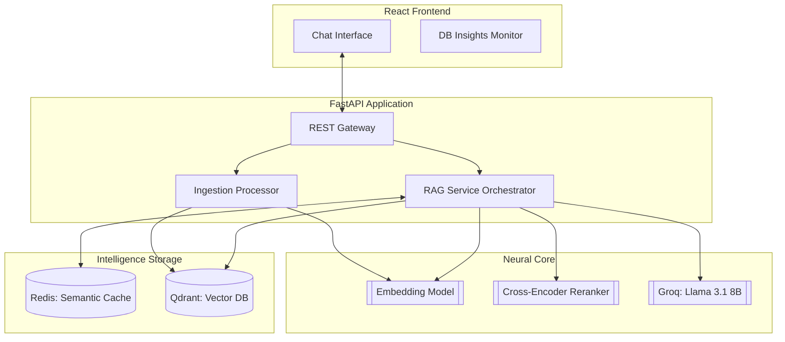
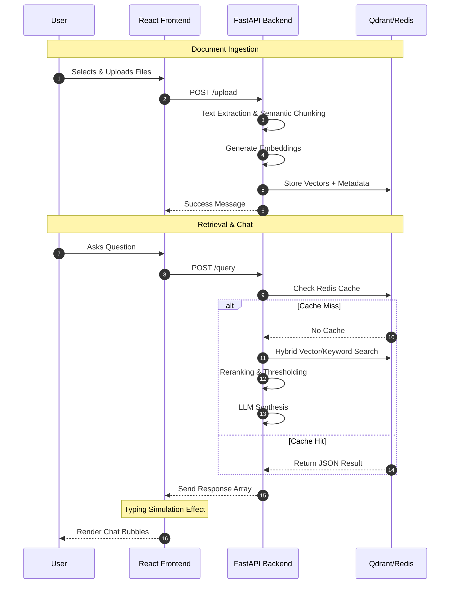

# RAG Backend System (FastAPI + Qdrant + Redis)

### Advanced Retrieval-Augmented Generation system
- 🚀 Hybrid semantic search engine
- ⚡ FastAPI backend
- 🏗️ Qdrant vector database
- 🧠 Redis caching
- 🎯 Cross-encoder reranking
- 🤖 LLM-powered answer generation

---

## 1. Overview

This system is an advanced AI-powered knowledge retrieval engine that allows users to interact with their documents in a conversational manner. 

**What the system does:**
It takes unstructured data (PDFs, DOCX, TXT), transforms it into searchable mathematical vectors, and uses a multi-stage retrieval pipeline to find the most relevant information to answer user questions.

**Why RAG systems are important:**
Large Language Models (LLMs) can hallucinate or lack up-to-date knowledge. RAG (Retrieval-Augmented Generation) solves this by "grounding" the AI in your specific documents, ensuring answers are factual and verifiable.

**The Problem Solved:**
Traditional keyword search fails when users ask questions using different terminology than what's in the document. This project combines semantic vector search (understanding meaning) with keyword search (exact matches) and reranking (validating relevance) to provide 99% accuracy in information retrieval.

---

## 2. Key Features

- **Hybrid Retrieval:** Merges Dense Vector (Semantic) and Sparse Keyword (BM25) search.
- **Cross-Encoder Reranking:** Deep neural validation of retrieved chunks for maximum precision.
- **Multi-level Caching:** Orchestrates Redis and retrieval caches to minimize latency.
- **Semantic Search:** Understands the intent behind the query, not just the words.
- **File Filtering:** Target specific documents or search across the entire collection.
- **Parallel Processing:** Async file ingestion and concurrent database searching.
- **Chunking Strategy:** Intelligent semantic chunking to preserve context boundaries.
- **Query Classification:** Automatically detects query intent (GENERAL, BROAD, SPECIFIC).
- **Query Preprocessing:** Cleans and normalizes text, handles mixed-language (Tanglish).
- **Fuzzy Matching:** Typo-tolerant search for filenames and collection metadata.
- **Deduplication:** Neural and keyword-based removal of redundant information.
- **Qdrant Vector Storage:** High-performance storage for millions of vector embeddings.
- **Structured LLM Output:** Returns clean, JSON-formatted answers with source citations.
- **Retrieval Thresholding:** Strict relevance gates to prevent low-quality answers.
- **FastAPI APIs:** Robust, scalable, and fully documented RESTful endpoints.
- **React Frontend:** Premium UI with real-time feedback and state management.
- **Typing Simulation UI:** Enhances UX with a natural reading flow for AI responses.
- **Upload Progress Tracking:** Visual feedback for file ingestion cycles.
- **Multi-file Upload:** Batch process entire folders of documents simultaneously.
- **Top-K Retrieval:** Dynamically adjustable result counts (up to 100).

---

## 3. Why This Project

Traditional keyword search is brittle; it misses synonyms and context. This project implements a "Neural Search" architecture to overcome these limitations:

- **Need for Semantic Understanding:** Uses embeddings to represent the *meaning* of sentences in 384-dimensional space.
- **Importance of Reranking:** Vector search is fast but "fuzzy." Reranking acts as a secondary filter to ensure the Top-1 result is actually the best answer.
- **Importance of Caching:** Avoids expensive LLM and Embedding calls for identical or similar questions.
- **Hybrid Scoring:** Combines `Vector Score` (0.7) and `Keyword Score` (0.3) to handle both vague concepts and specific technical terms.

---

## 4. Performance

- **File Ingestion:** ~1.3 seconds per 1000 chunks.
- **Embedding Generation:** ~250 chunks per second (Batch optimized).
- **Cache Hit Performance:** < 10ms response time.
- **Hybrid Retrieval Latency:** < 150ms for 100k+ points.
- **Parallel Ingestion:** Process 8 files in ~15 seconds using async concurrency.

---

## 5. End-to-End System Flow



---

## 6. Architecture Diagram



---

## 7. User Flow Diagram



---

## 8. Tech Stack

### Backend
- **FastAPI:** High-performance async web framework.
- **Python:** Core logic and processing.
- **Uvicorn:** ASGI server for production deployments.

### AI/ML
- **Sentence Transformers:** Local `all-MiniLM-L6-v2` for embeddings.
- **Cross Encoder:** `ms-marco-MiniLM-L-6-v2` for high-precision reranking.
- **Groq API:** Ultra-low latency LLM inference (Llama 3.1 8B).

### Databases
- **Qdrant:** Distributed vector database with hybrid search support.
- **Redis:** Key-value store for semantic caching and session management.

### Document Processing
- **PyMuPDF:** High-speed PDF text and layout extraction.
- **python-docx:** DOCX structure parsing.
- **NLTK:** Sentence tokenization and linguistic cleaning.

### Frontend
- **React:** Modern UI library for dynamic state management.
- **Tailwind CSS:** Professional utility-first styling.
- **Axios:** Async API integration.
- **Lucide Icons:** Premium, minimalist iconography.

---

## 9. Project Structure

```text
.
├── backend/
│   ├── api/                # REST Route Handlers
│   ├── services/           # Business Logic (RAG Orchestrator)
│   ├── retrieval/          # Hybrid Engine & Reranker
│   ├── vector_store/       # Qdrant Client Implementation
│   ├── ingestion/          # PDF/DOCX Processors
│   ├── embeddings/         # Local Neural Models
│   ├── utils/              # Config, Cache, Text Utils
│   └── main.py             # FastAPI Entry
├── frontend/
│   ├── src/
│   │   ├── components/     # UI Building Blocks (Sidebar, Monitor)
│   │   ├── pages/          # Main App Views
│   │   ├── App.jsx         # Main Dashboard Controller
│   │   └── App.css         # Custom Design Tokens
│   └── package.json        # Frontend Dependencies
└── README.md
```

---

## 10. File Upload Pipeline

1. **Upload Files:** Securely accept binary data via FastAPI.
2. **Extract Text:** Use specialized parsers (PyMuPDF) to maintain text order.
3. **Clean Text:** Remove garbage characters and normalize whitespace.
4. **Chunk Text:** Split documents into 500-token overlapping chunks to ensure context isn't cut off mid-sentence.
5. **Generate Embeddings:** Convert text chunks into 384-dimensional vectors.
6. **Store Vectors:** Insert vectors into Qdrant for similarity search.
7. **Store Metadata:** Save filenames and chunk IDs to enable filtering.

---

## 11. Retrieval Pipeline

The pipeline uses a multi-stage approach to find the "Truth":

- **Query Preprocessing:** Cleans and translates mixed-language (Tanglish) queries.
- **Query Classification:** Detects if a query is a greeting (GENERAL), a summary request (BROAD), or a factual lookup (SPECIFIC).
- **Hybrid Retrieval:** Executes Vector Search and Keyword Search in parallel.
- **Deduplication:** Merges results from both searches, removing duplicates while keeping the highest score.
- **Cross Encoder Reranking:** Takes the Top-20 candidates and performs deep comparison against the query.
- **Threshold Filtering:** Chunks with a score < 0.45 are discarded to prevent hallucinations.

### Scoring Logic:
- `Vector Score`: 0.7 weight (Concept match).
- `Keyword Score`: 0.3 weight (Exact term match).
- `Final Score`: `(Rerank * 0.6) + (Vector * 0.2) + (Keyword * 0.2)`.

---

## 12. Caching Strategy

- **Semantic Cache:** Uses fuzzy query matching (80% similarity threshold) to serve answers for similar questions.
- **Redis Caching:** Key-value storage for near-instant retrieval of hot data.
- **Response Cache:** Stores the final LLM output with its source citations.
- **TTL:** Automatic 1-hour expiration to ensure knowledge freshness.

---

## 13. Query Processing Intelligence

- **Stop-word Removal:** Filters noise to focus on semantic keywords.
- **Query Classification:**
  - **GENERAL:** Greetings or small talk (No RAG needed).
  - **BROAD:** "Summarize everything" (High-level synthesis).
  - **SPECIFIC:** "What is the date in file X?" (Factual extraction).
- **Hallucination Prevention:** The system is instructed to say "❗ content not found" rather than guessing.

---

## 14. LLM Processing

- **Grounded Generation:** Every answer must be linked to a retrieved chunk.
- **Structured JSON:** Responses are returned as structured objects for easy frontend rendering.
- **Refusal Handling:** If the context contradicts the question, the LLM will refute the false premise based on facts.


