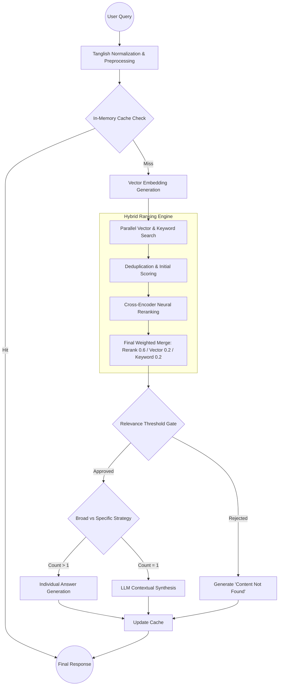

# 🚀 Advanced Hybrid RAG System

A high-performance, full-stack **Retrieval-Augmented Generation (RAG)** application built with FastAPI, React, and Qdrant. This system features hybrid search (Vector + Keyword), Cross-Encoder reranking, and specialized support for mixed-language (**Tanglish**) queries.

---

## 🌟 Overview

This project is a sophisticated RAG pipeline designed to turn static documents into interactive knowledge bases. It goes beyond simple vector search by combining semantic understanding with precise keyword matching and neural reranking.

- **Intelligent Retrieval:** Hybrid pipeline combining Dense Vector search and Sparse Keyword search.
- **Neural Reranking:** Uses Cross-Encoders to verify the relevance of candidates before generation.
- **Mixed-Language Support:** Specialized handling for **Tanglish** (Tamil + English) query normalization.
- **Dynamic Answer Control:** Users can request up to 100 individual answers per query.
- **Modular Architecture:** Clean separation between ingestion, retrieval, and generation services.

---

## 🛠️ Tech Stack

### Backend (Python / FastAPI)
- **FastAPI:** High-performance web framework for APIs.
- **Qdrant:** Vector database for high-dimensional similarity search.
- **Sentence-Transformers:** For generating embeddings (`all-MiniLM-L6-v2`) and reranking (`ms-marco-MiniLM-L-6-v2`).
- **Groq API:** Powers the LLM layer using `Llama-3` for ultra-fast response generation.
- **PyMuPDF & python-docx:** Robust text extraction from multiple file formats.

### Frontend (React / Vite)
- **React 18:** Modern UI component architecture.
- **Vanilla CSS:** Custom design system with modern aesthetics and glassmorphism.
- **Lucide React:** Premium icon set for a sleek user experience.
- **Axios:** Efficient API communication with abort-controller support.

---

## 📐 System Architecture

### End-to-End Request Flow



---

## 🚀 Key Features

### 1. Hybrid Retrieval Pipeline
Combines the semantic power of `all-MiniLM-L6-v2` with precise keyword matching to ensure that even technical terms or specific names are never missed.

### 2. Intelligent Strategy Selection
- **BROAD Strategy:** Synthesizes multiple documents into one comprehensive overview.
- **SPECIFIC Strategy:** Generates multiple distinct answers based on individual relevant sections.

### 3. Tanglish Understanding
The system can understand queries like *"Photosynthesis pathi sollu"* or *"10 points kudu about birds"*, automatically normalizing them to standard English for better database matching.

### 4. Database Insights
A real-time monitor that tracks collection health, point counts, and allows for direct management/deletion of vector collections from the UI.

---

## 📂 Project Structure

```
.
├── backend/
│   ├── api/             # FastAPI Route definitions
│   ├── services/        # Core RAG logic & LLM orchestration
│   ├── retrieval/       # Hybrid search & Reranking engine
│   ├── ingestion/       # Document processing & chunking
│   ├── vector_store/    # Qdrant integration
│   ├── utils/           # Config, Cache, and Text utilities
│   └── main.py          # Application entry point
├── frontend/
│   ├── src/             # React components & UI logic
│   │   ├── App.jsx      # Main Chat & Dashboard interface
│   │   └── App.css      # Custom design system
│   └── public/          # Static assets
└── qdrant_db/           # Local vector storage (when not using cloud)
```

---

## 🚦 Getting Started

### 1. Prerequisites
- Python 3.9+
- Node.js 18+
- [Groq API Key](https://console.groq.com/)
- [Qdrant Cloud Account](https://cloud.qdrant.io/) (Optional, can run locally)

### 2. Backend Setup
```bash
cd backend
python -m venv venv
source venv/bin/activate  # venv\Scripts\activate on Windows
pip install -r requirements.txt
```
Create a `.env` file in the `backend` directory:
```env
GROQ_API_KEY=your_key_here
QDRANT_URL=your_qdrant_url
QDRANT_API_KEY=your_qdrant_key
```
Run the server:
```bash
uvicorn main:app --reload
```

### 3. Frontend Setup
```bash
cd frontend
npm install
npm run dev
```

---

## 📖 API Documentation

### `POST /query`
Performs a RAG search.
- **Body:** `{ "query": "string", "num_answers": int, "collection_name": "string" }`
- **Response:** List of generated answers with sources and relevance scores.

### `POST /upload`
Ingests multiple files (PDF, DOCX, TXT).
- **Body:** `Multipart/form-data` with `files` list.

### `GET /stats`
Returns point counts and health for all active vector collections.

### `DELETE /collection/{name}`
Permanently removes a collection from the database.

---

## 🛡️ License
This project is licensed under the MIT License - see the LICENSE file for details.
