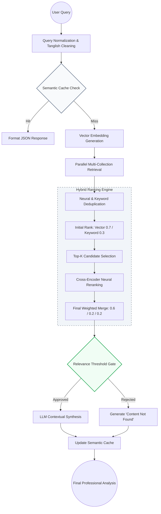
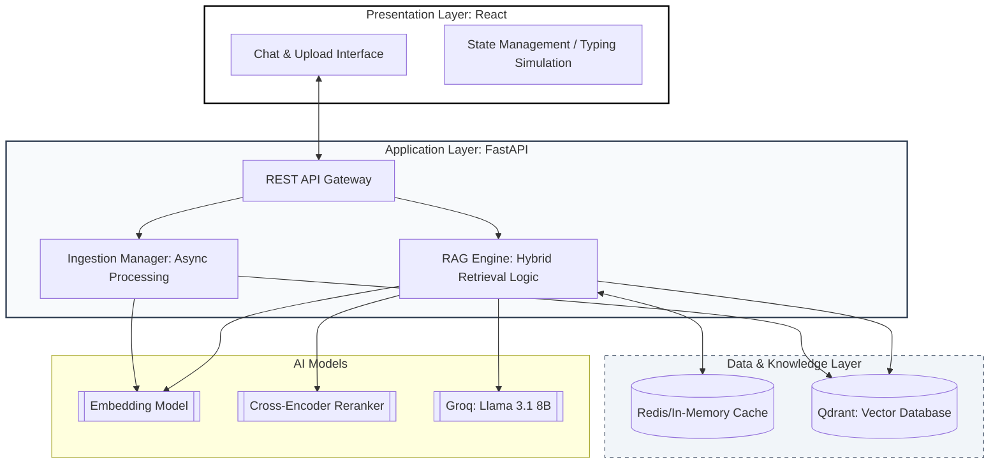
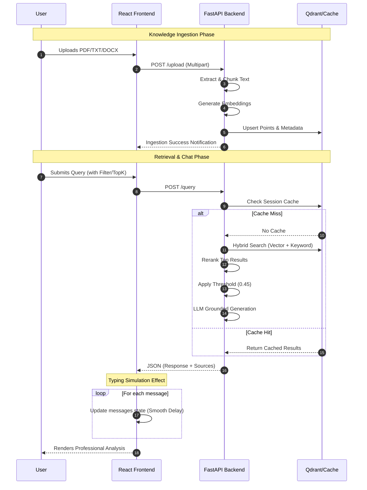

# RAG Backend System (FastAPI + Qdrant + Redis)

A high-performance **Retrieval-Augmented Generation (RAG)** backend built with FastAPI.

---

## Overview

This project is an advanced Retrieval-Augmented Generation (RAG) system that enables users to:

- Upload documents (PDF, DOCX, TXT)
- Perform intelligent semantic + keyword search
- Generate structured answers using LLMs (Grounded in context)
- Filter results by specific documents
- Optimize performance with multi-layer session caching

It combines vector search, keyword retrieval, and reranking to produce highly relevant answers, even for mixed-language (Tanglish) queries.

---

## Key Features

- **Hybrid Retrieval:** Dense Vector Search + Keyword Matching.
- **Cross-Encoder Reranking:** Deep validation of result relevance.
- **Multi-level Caching:** In-memory session cache with fuzzy query matching.
- **File-level Filtering:** Target specific uploaded documents for answers.
- **Parallel File Ingestion:** Concurrent processing of multiple document uploads.
- **Semantic Chunking:** Context-aware document splitting (500 tokens).
- **Structured LLM Output:** Clean JSON responses with source citations.
- **Tanglish Support:** Understands Tamil-English mixed queries (e.g., "Sollu", "Kudu").

---

## Why This Project

Traditional search systems fail to understand semantic meaning and context. This project solves that by combining:

- **Dense vector search:** Semantic understanding of query intent.
- **Sparse keyword search:** Exact term matching for technical jargon.
- **Cross-encoder reranking:** High-precision neural verification.
- **Caching:** Sub-millisecond response time for repeated queries.

**Result:** Faster and more accurate responses over large document collections.

---

## Performance

- **File ingestion (1000+ chunks):** ~1.3 seconds
- **Embedding Generation:** Batch processed at ~250 chunks/sec
- **Cache hit:** ~instant (< 10ms)
- **Hybrid retrieval:** Optimized for low latency (< 150ms)

---

## SystemFlow-Diagram



---

## ArchitectureFlow-Diagram



---

## UserFlow-Diagram



---

## Tech Stack

### Backend
- **FastAPI:** Async web framework
- **Qdrant:** Vector Database
- **Redis (In-Memory):** Session Caching
- **Sentence Transformers:** Local Embeddings
- **Cross Encoder:** Neural Reranking
- **Groq API:** Llama 3.1 8B Inference
- **PyMuPDF & python-docx:** Document Processing

### Frontend
- **React (Vite):** Frontend Library
- **Tailwind CSS:** Modern Styling
- **Axios:** API Integration
- **Lucide Icons:** Iconography

---

## Project Structure

```text
.
├── backend/
│   ├── api/                # API Endpoints (routes.py)
│   ├── services/           # Orchestration (rag_service.py)
│   ├── retrieval/          # Hybrid Engine (query_engine.py)
│   ├── vector_store/       # DB Management (qdrant_store.py)
│   ├── ingestion/          # Parsing (processor.py)
│   ├── embeddings/         # Local Models (model.py)
│   ├── utils/              # Config, Cache, Text Utils
│   └── main.py             # Entry Point
├── frontend/
│   ├── src/
│   │   ├── components/     # UI Components
│   │   └── App.jsx         # Main App logic
│   └── package.json        # Dependencies
└── README.md
```

---

## File Upload Flow

1. **Upload files** via `POST /upload`
2. **Extract text** from PDF, DOCX, or TXT
3. **Clean and preprocess** document content
4. **Chunk text** into overlapping 500-token segments
5. **Generate embeddings** using local neural models
6. **Store in Qdrant** with metadata (filename, ID)
7. **Store metadata** for advanced filtering

---

## Retrieval Pipeline

- **Query Normalization:** Handles Tanglish and typos.
- **Vector Search:** Dense retrieval for semantic concepts.
- **Keyword Search:** Sparse retrieval for exact matches.
- **Hybrid Merge:** Weighted combination of results.
- **Cross Encoder Reranking:** Secondary deep validation.
- **Threshold Filtering:** Removal of low-confidence results (< 0.45).

---

## Caching Strategy

- **Embedding Cache:** Avoids re-computing identical vectors.
- **Retrieval Cache:** Stores raw database results.
- **Response Cache:** Stores the final LLM-generated answers.
- **Session Caching:** Fuzzy matching for similar user queries.

---

## LLM Processing

Generates grounded, professional responses in structured JSON format:

```json
{
  "answers": [
    {
      "answer": "Detailed answer based on context...",
      "sources": [{"file_name": "...", "score": 0.95}]
    }
  ]
}
```

---

## API Endpoints

### POST /query
```json
{
  "query": "What is photosynthesis?",
  "collection_name": "optional",
  "num_answers": 3
}
```

### POST /upload
Accepts a list of files (`Multipart/form-data`) for background processing.

### GET /stats
Returns point counts and names for all active database collections.

### DELETE /collection/{name}
Permanently removes a collection from the database.

---

## How to Run

### Backend
```bash
cd backend
pip install -r requirements.txt
uvicorn main:app --reload
```

### Frontend
```bash
cd frontend
npm install
npm run dev
```

---

## Features

- **Multi-document retrieval:** Search across all collections simultaneously.
- **File filtering:** Lock search to specific documents.
- **Hybrid search:** Best-in-class retrieval precision.
- **Reranking:** Minimizes hallucinations.
- **Redis/Memory caching:** Extreme performance.
- **Tanglish Support:** Localized language understanding.
- **Live DB Insights:** Visual monitoring of your knowledge base.

---

# Frontend (React + Tailwind CSS)

A modern, responsive UI for interacting with the RAG backend.

---

## Frontend Structure

```text
frontend/
├── public/                 # Static assets (favicons, manifest)
├── src/
│   ├── assets/             # Global media and image assets
│   ├── components/         # Reusable UI building blocks
│   ├── App.jsx             # Root Component (Chat logic, File handling)
│   ├── App.css             # Component-level styling & Design tokens
│   ├── index.css           # Global Tailwind directives & resets
│   └── main.jsx            # Application entry & DOM mounting
├── package.json            # Scripts and dependencies
├── vite.config.js          # Vite build & proxy settings
└── index.html              # Entry HTML template
```

---

## UI Highlights

- **Clean minimal UI:** Professional indigo/slate aesthetic.
- **Fully responsive:** Works on mobile and desktop.
- **Smooth animations:** Includes typing simulations and progress bars.
- **No scrollbar UI:** Custom hidden scroll for a premium feel.
- **Hover Transitions:** Contextual actions (like Delete) appear on interaction.
